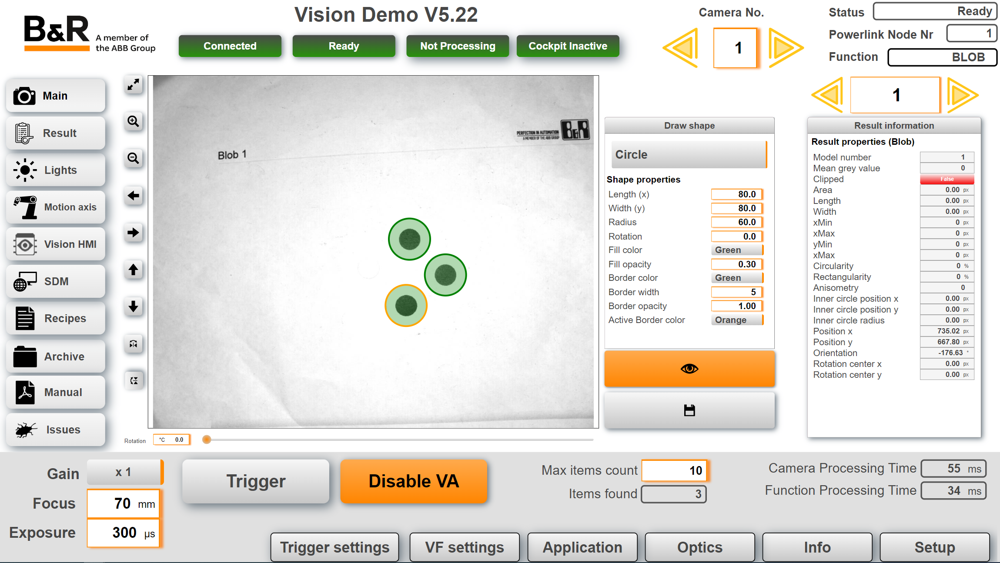

## Table of Contents
* [Introduction](#Introduction)
* [Features](#Features)
* [Requirements](#Requirements)
* [Revision History](#Revision-History)

## Introduction
This is a demo application for B&R vision camera. It is developed and maintained by vision enthusiasts and is not and official B&R product. For a detailed description see this [**documentation**](Logical/Documentation/Vision%20Demo%20Application.pdf). 

**Note:** A basic version of this demo can be found [**here**](https://github.com/br-automation-com/mappVision-Demo/tree/basic)

**Note:** For better alignment between the index number and IO names most arrays start at index 1 (not 0). This can cause issues with C Task since these tasks do not support arrays starting at index 1. Most arrays can be redefined starting with 0 without any issues from a code perspective but it will cause an empty line in the mappView result tables.

**Note:** There is a user task with actions and type definitions to ease embedden user code in the vision task. 

## Features
This vision sample contains a lot of functions that are not included in the mappVision HMI (Vision cockpit). These include:
- Easy-to-use mappView visualization
- All IO data points of the camera are connected to the visualization
- Image archive to save the images
    - different formats available (jpg, bmp)
    - selection of quality levels for compressed images (jpg)
    - Embedded overlay on the image
- Rotation of the image on the main page
- fast repetitive mode (5 fps/200ms)
- Simultaneous use of several cameras in one visualization
- Use of the nettime function together with axes
- Integration of Lightbar and Backlight
- Recipe management for the used parameters

## Requirements (current used versions)
Should also work with newer and some older versions
* Automation Studio 4.12
* Automation Runtime B4.93 or higher
* mapp 5.22 (Cockpit, motion, service, view, vision) 
*Chrome Browser

Recommended task class is #8 with a 10ms cycle time. For the nettime and axis tasks use #1

#### version 5.22.1
Fixed:
- Recipe for vision task did not work as the light loop overwritten the index string
- Page fault for click on image if no element was clicked twice. Removed style creating string as it was not needed at the start for click

Modifided:
- Set project up to include user drive web folder, as this includes the issue web page.
- Match score and scale er now in percent
- Added units for matching results

#### version 5.22.0
- Updated to AS 4.12
- Updated to Mapp 5.22
- Major rework of the entire application
- Added brdk vision libraries to the project
- No need to route any more
- Always using nettime for triggering
- Support of multiple camera at the same time
- Prepared for smart camera support, which will be implementated later on

#### Version 5.15
- Update recipe managment to V1.0
- Updated constant for code reader parameter "ParameterMode"
- Fix ViColor
- Make it possible to change connections
- Updated to official 5.15 versions and official lightbar upgrade
- Vi_Optics added

#### Version 2.3
 - Added RouteInfo_Tool.ps1
 - Added color detection first version
 - Split up main task into main and visu, integrated light task into main and visu
 - Added functionality to rotate the image on the main page
 - Click on the image on the main page toggles now the text position (crosshair-details) from left to right
 - CodeReader and OCR Text will be shown on the main page and saved in SVG file
 - Added proxy task to eliminate routing batch file
 - Added Pixel Counter hardware and code
 
#### Version 2.2
- Added new functionality to show images in every size on the web viewer widget on the main page
- Improved repetitive mode
- SVG files save now all information. It is possible to click on the crosshairs to show the details
- Added diagnostic data creation
- Updated recipe management
- Changed public arrays start index to 0 to avoid issues with C task
- Added a VC4 visualization
- Added functionality to show the image on the VC4 visualization (documentation still missing)
- After boot the first found light will be selected
- Some additional improvements, code optimizations & bug fixes

#### Version 2.1
- First public release
