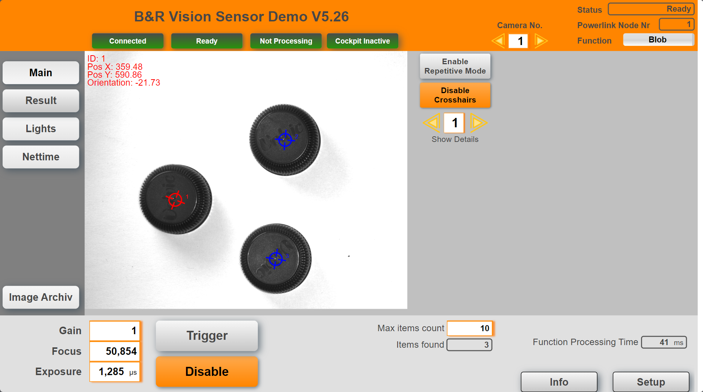

## Table of Contents
* [Introduction](#Introduction)
* [Requirements](#Requirements)
* [Revision History](#Revision-History)

## Introduction
This is a demo application for B&R vision camera. It is devloped and maintained by vision enthusiasts and is not and official B&R product. For a detailed description see this [**documentation**](Logical/Documentation/Vision%20Demo%20Application.pdf). Download the latest release from [**here.**](../../releases)

**Note:** For better alignment between the index number and IO names most arrays start at index 1 (not 0). This can cause issues with C Task since these tasks do not support arrays starting at index 1. Most arrays can be redefined starting with 0 without any issues from a code perspective but it will cause an empty line in the mappView result tables.

## Requirements (current used versions)
Should also work with newer and some older versions
* Automation Studio 4.7
* mappView 5.11.2
* mappVision 5.11.0
* Automation Runtime A4.73
* mappMotion 5.11.2 (for nettime functions in combination with the included axis)
* mappCockpit 5.11.0 (for mappMotion)
* mappServices 5.11.2 (for mappRecipe)

Recommended task class is #8 with a 10ms cycle time. For the nettime and axis tasks use #1

## Revision History
You can find details in the project in "revision.txt"

#### Version 2.2
- A lot of improvements, check the revision.txt for details

#### Version 2.1
- First public release